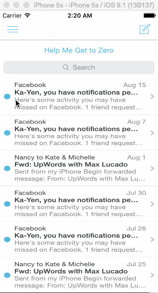

# mailbox-w3

This is an iOS demo appliction is to leverage animations and gestures to implement more sophisticated interactions.

Time spent: 7 hours spent in total

Completed user stories:

 Required: Mailbox screen
 Required: Message Interaction, on dragging to the left
 Required: Message Interaction, on dragging to the right
 
 
 